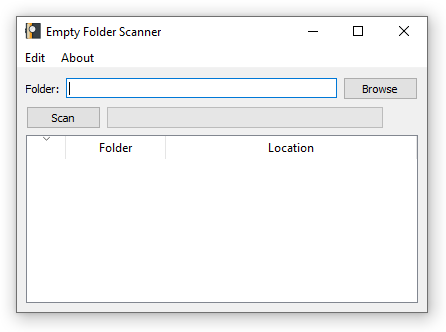

# Empty Folder Scanner

## Description

Empty Folder Scanner is a simple and intuitive application to find and manage empty folders on your computer. Choose a folder to scan, and the application will list all the empty folders within it. You can then select and delete the empty folders you don't need.

## Features

- Scan for empty folders within a selected directory
- Display the list of empty folders with their locations
- Select and delete empty folders
- Progress bar indicating the scanning process
- Select all / Deselect all functionality

## Usage

1. Either clone the project **OR** download the `folder-scanner.exe` file inside the _dist_ folder and run it. Give it a sec the first time.
2. Click the **Browse** button to select a folder to scan.
3. Click the **Scan** button to start the search for empty folders. 
   **NOTE!** It might take a second at first to start the scan.

4. Once the scan is complete, you can see the list of empty folders with their names and locations.

5. You can open the scanned folders by _Right-Clicking_ on on the row and selecting `Open File Location`.

6. Select the folders you want to delete and click the **Delete** option from the **Edit** menu or press the **Del** key on your keyboard.
7. Confirm the deletion, and the selected folders will be removed.

8. And that's it!

### Leave a feedback! Thank you and enjoy!

## About

This project is developed by Dima Markélov.

- [LinkedIn](https://www.linkedin.com/in/dmitri-mark%C3%A9lov/)

## Feedback and Contributions 📧

Feedback, bug reports, and pull requests are welcome.

## License 🎨

Open Source. Feel free to use how you wish.
